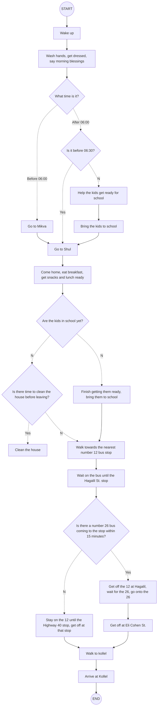

# Morning Schedule Flowchart

```mermaid
flowchart TD;

A((START)) --> B[Wake up];
B --> C[Wash hands, get dressed, say morning blessings];
C --> D{What time is it?};
D -.Before 06:00.-> E[Go to Mikva];
D -.After 06:00.-> F{Is it before 06:30?};
E-->G[Go to Shul];
F-.Yes.->G;
F-.No.->H[Help the kids get ready for school];
H-->I[Bring the kids to school];
I-->G;
G-->J[Come home, eat breakfast, get snacks and lunch ready];
J-->K{Are the kids in school yet?};
K -.No.-> L[Finish getting them ready, bring them to school];
K -.No.-> M{Is there time to clean the house before leaving?};
M-.Yes.->N[Clean the house];
M-.No.->O[Walk towards the nearest number 12 bus stop];
L-->O;
O-->P[Wait on the bus until the Hagalil St. stop];
P-->Q{Is there a number 26 bus coming to the stop within 15 minutes?};
Q-.Yes.->R[Get off the 12 at Hagalil, wait for the 26, go onto the 26];
R-->S[Get off at Eli Cohen St.];
Q-.No.->T[Stay on the 12 until the Highway 40 stop, get off at that stop];
T-->U[Walk to kollel];
S-->U;
U-->V[Arrive at Kollel];
V-->W((END));
```
