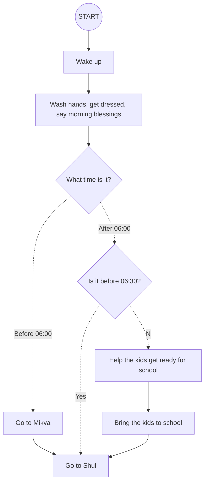

# Morning Schedule Flowchart

```mermaid
flowchart TD;

A((START)) --> B[Wake up];
B --> C[Wash hands, get dressed, say morning blessings];
C --> D{What time is it?};
D -.Before 06:00.-> E[Go to Mikva];
D-.After 06:00.->F{Is it before 06:30?};
E-->G[Go to Shul];
F-.Yes.->G;
F-.No.->H[Help the kids get ready for school];
H-->I[Bring the kids to school];
I-->G;
```
