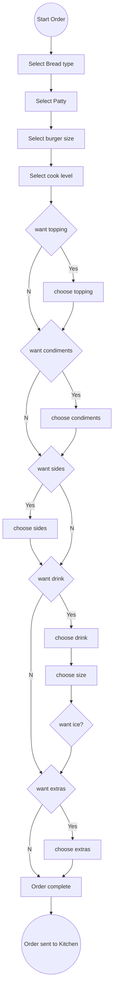

## General Putnam Motel Diner - Orders  

# Introduction

The General Putnam Motel Diner API allows you to order for meals through their app.  
There are two main parts to this:  
* **GET** request - This is a call sent when the client asks for the bill. The GET request includes the Table number and order number.   
Takeout orders are table 99.  Documented in [Get.md](https://github.com/RinaSol/student-showcase/blob/API_Project/GET.md)   
* **POST** request - This command is to process the requested order and is sent to the kitchen.  
  On receiving an OK, the order is printed in the kitchen so that the cook can begin cooking. Documented in [POST.md](https://github.com/RinaSol/student-showcase/blob/API_Project/POST.md)

# Error Codes

The following are the HTTP status codes for success or failure of an API call. 

| Status | Code Description | 
| --- | --- |
| 200 - OK  | Your request was successful. |
| 400 - Bad Request | Error. Check your order for unsupported additions.|
| 401 - Unauthorized Request | Error. Is all information in the request correct?  |
| 402 - Request Failed | Your order was not received  |
| 404 - Not Found  | Page not found|

# Workflow  

# References
This exercise was borrowed and adapted from Alex Fiedler.  
Workflow was created with the help of Mermaid.  
Error Code was copied from the API Guide (Adapted from Alex Fiedler)

   
  
