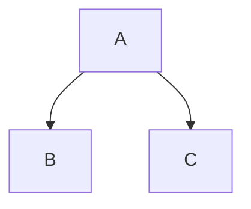
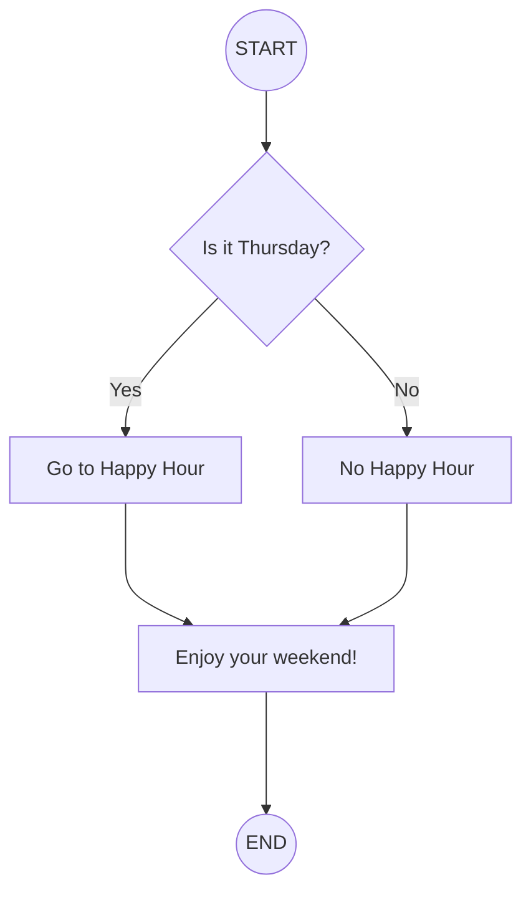
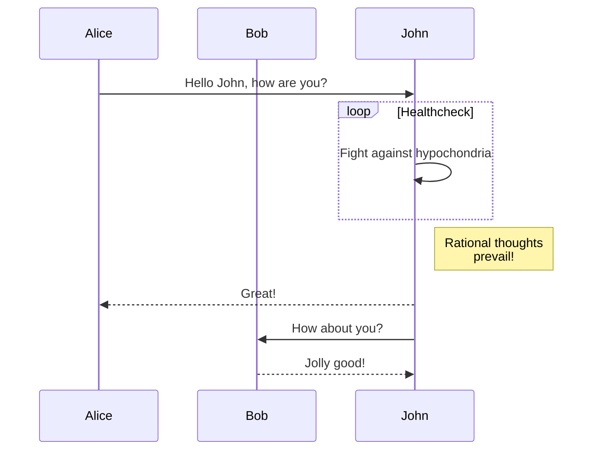
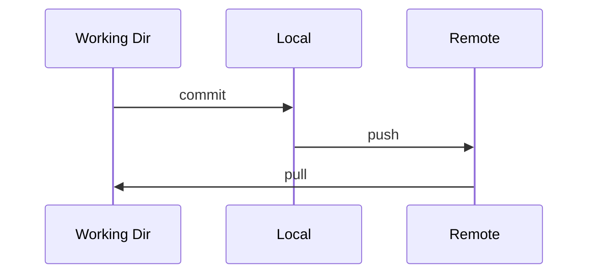
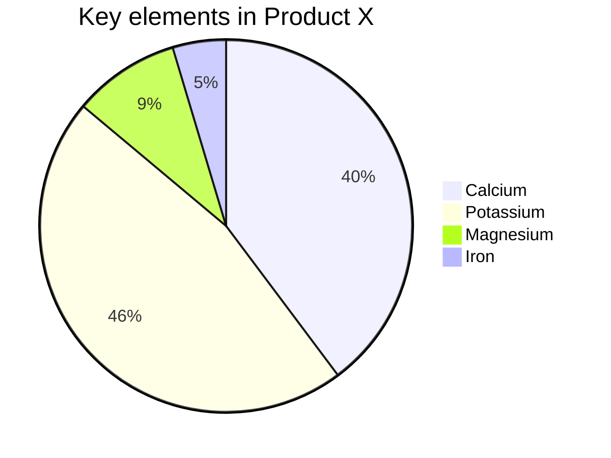

# Basic Diagram

```mermaid 
   graph TD;
   A-->B;
   A-->C;
```  
# Flowchart Diagram

```mermaid
   flowchart TD;
   
   A((START)) --> B{Is it Thursday?};
   B -- Yes --> C[Go to Happy Hour];
   B -- No --> D[No Happy Hour];
   C ---> E[Enjoy your weekend!];
   D ---> E[Enjoy your weekend!];
   E ---> F((END))
```   
# Sequence Diagram

```mermaid
   sequenceDiagram;
   
    participant Alice
    participant Bob
    Alice->>John: Hello John, how are you?
    loop Healthcheck
        John->>John: Fight against hypochondria
    end
    Note right of John: Rational thoughts <br/>prevail!
    John-->>Alice: Great!
    John->>Bob: How about you?
    Bob-->>John: Jolly good!
```

```mermaid
   sequenceDiagram;

    participant Working Dir 
    participant Local
    participant Remote
    Working Dir->>Local: commit
    Local->>Remote: push
    Remote->>Working Dir: pull
```  
# Pie Chart

```mermaid
   pie
    title Key elements in Product X
    "Calcium" : 42.96
    "Potassium" : 50.05
    "Magnesium" : 10.01
    "Iron" :  5
```
   
   Source [mermaid project](https://mermaid-js.github.io/mermaid/#/)
   
