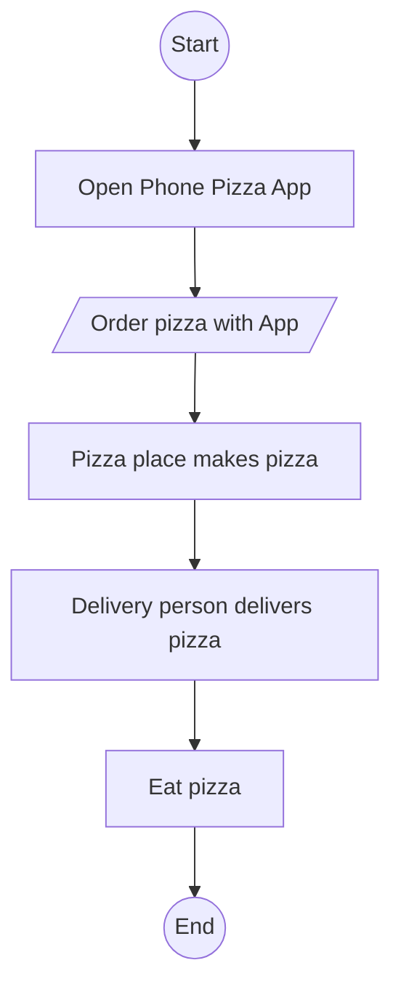
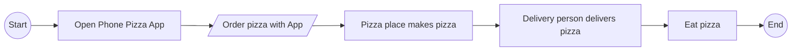
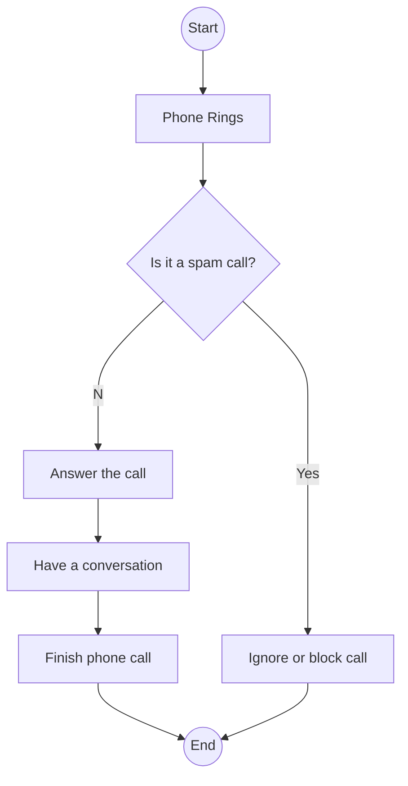
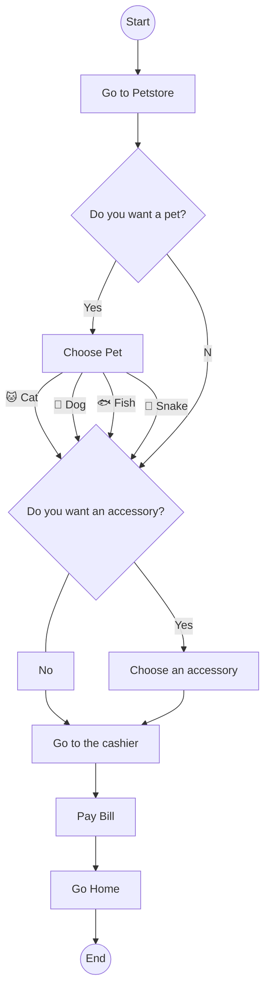

# Mermaid Examples
## Flowchart Simple Top-Down

```mermaid
   flowchart TD
   A((Start))-->B[Open Phone Pizza App];
   B-->C[/Order pizza with App/];
   C-->D[Pizza place makes pizza];
   D-->E[Delivery person delivers pizza];
   E-->F[Eat pizza];
   F-->G((End));
```
## Flowchart L->R 

```mermaid
   flowchart LR
   A((Start))-->B[Open Phone Pizza App];
   B-->C[/Order pizza with App/];
   C-->D[Pizza place makes pizza];
   D-->E[Delivery person delivers pizza];
   E-->F[Eat pizza];
   F-->G((End));
```
## Flowchart with a Decision

```mermaid
   flowchart TD
   A((Start))-->B[Phone Rings];
   B-->C{Is it a spam call?};
   C--No-->D[Answer the call];
   C--Yes-->E[Ignore or block call];
   D-->F[Have a conversation];
   F-->G[Finish phone call];
   G-->H((End));
   E-->H;
```
## Flowchart with Multiple Decisions and Choices and Some Emojis

```mermaid
   flowchart TD
   A((Start))-->B[Go to Petstore];
   B-->C{Do you want a pet?};
   C--Yes-->D[Choose Pet];
   D--"🐱 Cat"-->E;
   D--"🐶 Dog"-->E;
   D--"🐟 Fish"-->E;
   D--"🐍 Snake"-->E;
   C--No-->E{Do you want an accessory?} 
   E--Yes-->F[Choose an accessory];
   E---No-->G[Go to the cashier];
   F-->G;
   G-->H[Pay Bill];
   H-->I[Go Home];
   I-->K((End));
```
