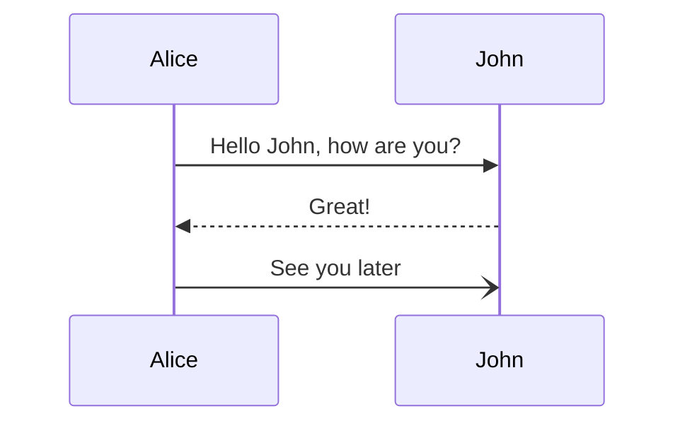
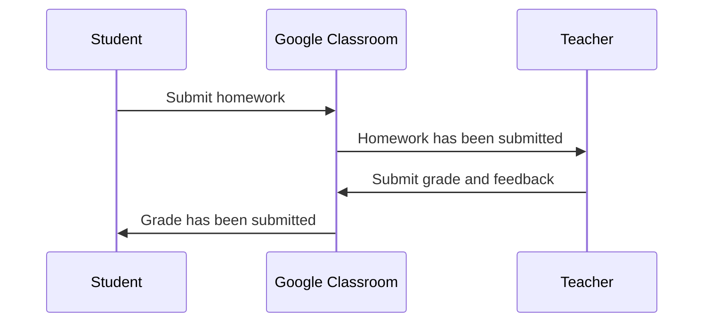

# Mermaid Sequence Diagrams

## Two Connectors

```mermaid
sequenceDiagram
    Alice->>John: Hello John, how are you?;
    John-->>Alice: Great!;
    Alice-)John: See you later;
```

## Three Connectors

```mermaid
sequenceDiagram
    Student->>Google Classroom: Submit homework;
    Google Classroom->>Teacher: Homework has been submitted;
    Teacher->>Google Classroom: Submit grade and feedback;
    Google Classroom->>Student: Grade has been submitted;
```
