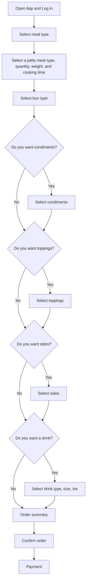

# Hamburger API Docs for General Putnal Motel Diner

This project is to create a Hamburger App POC for takeout orders for General Putnam Motel Diner. The API facilitates meal ordering through an App. 
There files in this project document the following endpoints:
* [POST/order](POST-order-meal.md) - creates a meal order and sends it to the kitchen
* [GET/bill](GET-bill.md) - creates a bill when the customer is ready to pay  

The Response codes file contains possible HTTP responses after a request for a meal order.

## Workflow
Below diagram illustartes the workflow from the order stage to pay stage. 

This project is influenced by [Alex Fiedler's](https://www.linkedin.com/feed/update/urn:li:activity:6626465471241732096/) API documentation [exercise](https://docs.google.com/document/d/11uNd8m5EorsLjGV84CjiJehiM8PxT2pdNbDFOnP3cDI/edit#heading=h.f479xyvxp0st).  
Additioanl resources include [API referencing guide](https://github.com/thegooddocsproject/templates/blob/master/api-reference/about-api-reference.md) from the [Good Docs Project](https://github.com/thegooddocsproject) and [Mermaid](https://github.com/mermaid-js/mermaid#readme) diagram chart.
