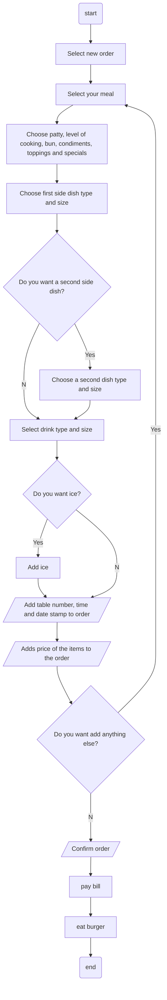

# Lunch API: Ordering a Burger
Lunch API is an application for ordering lunch through an application. We will go over ordering a burger meal.   
Ordering a burger includes two requests: POST and GET. Use the POST request for creating the order and the GET request for gathering data for the bill.
- [POST request](post.md)
- [GET request](get.md)  

 
This flowchart represents the procedure of ordering a burger at the diner:

## Credits:
- Credits to [Alex Fiedler](linkedin.com/in/alexfiedler) for [this exercise](https://docs.google.com/document/d/11uNd8m5EorsLjGV84CjiJehiM8PxT2pdNbDFOnP3cDI/edit#).
- Credits to the [Good Docs Project](https://thegooddocsproject.dev/) for the [reference template](https://github.com/thegooddocsproject/templates/edit/master/api-reference/api-reference.md).
