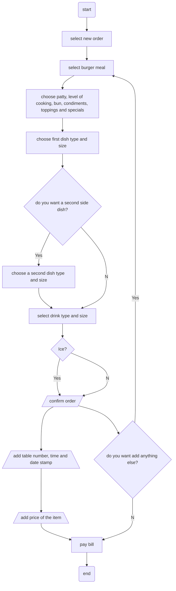

# Lunch API: Ordering a Burger
Lunch API is an application for ordering lunch through an application. We will go over ordering a burger meal.   
Ordering a burger includes two requests: POST and GET. Use the POST request for creating the order and the GET request for gathering data for the bill.  
This flowchart represents the procedure of ordering a burger at the diner:

