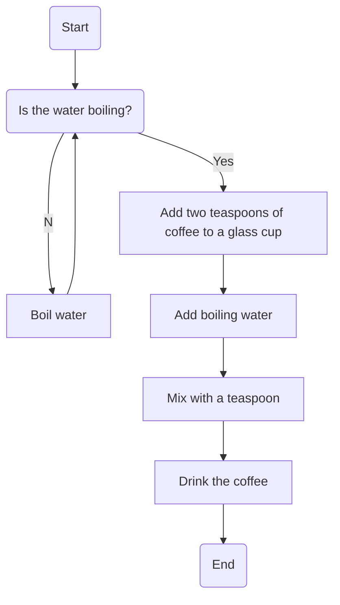

# Turkish Coffee  

```mermaid
  graph TD;
      A(Start)-->B(Is the water boiling?);  
      B--Yes-->C[Add two teaspoons of coffee to a glass cup];
      B--No-->D[Boil water];
      D-->B;
      C-->E[Add boiling water];
      E-->F[Mix with a teaspoon];
      F-->G[Drink the coffee];
      G-->H(End);
```
