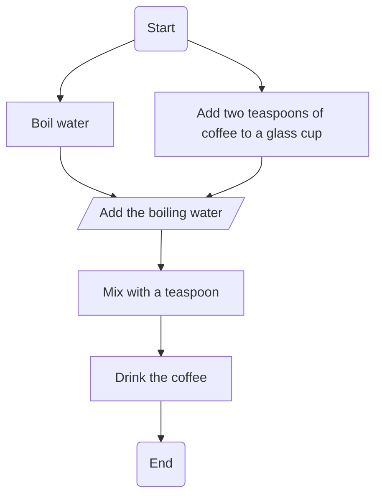

# Turkish Coffee  

```mermaid
  graph TD;
      A(Start)-->B[Boil water ];
      A-->C[Add two teaspoons of coffee to a glass cup];
      B-->D[/Add the boiling water/];
      C-->D;
      D-->E[Mix with a teaspoon];
      E-->F[Drink the coffee];
      F-->G(End);
```
