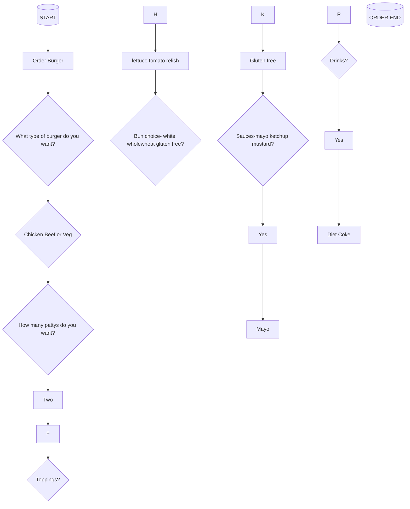

# Debbie-Mankowitz-showcase-
Our Best Words Student Showcase and Portfolio
## API Hamburger DOC for General Putnam Motel Diner

This is the preliminary version of the new Hamburger App for take-out orders from the General Putnam Motel Diner (GPMD). 
If this App featuring only types of hamburgers is successful, new offerings will be added to the take-out menu.

The App serves as an interface between the customer, their orders and the chef in the kitchen of GPMD.
Once the App receives the order the order is printed out in the kitchen for the GPMD chef.

The App uses REST which is flexible and reusable which suits the menu App as modules will be added, substituted, or adjusted.
A REST API leverages HTTP methods which in this instance includes a GET request to fetch data and POST request to create data;
* [GET] (get.md) to retrieve data from the server, POC in this case the bill, once the order has been placed.
* [POST] (get.md) sends data to the server, the customers order is printed in the kitchen of GPMD once received.

### References 

* Astera Enabling Data Innovation
What is REST API

* Alex Fiedler 
General Putnam Motel Diner API Guide

### Workflow 

curl --location --request POST 'https://api.gpmd.com' \ 
--header 'Authorization: 
https://docs.google.com/document/d/1jBZeW-5fZ450NM-CZZply_wbW6p5LdkmQBMno' \ --header 'Accept: application/json' \ 
--header 'Content-Type: application/json' \ 
--data-raw '{ 
“meal_type”:“dinner", 
“main”:“ ”, 
“main_quantity”:1, 
“side”:“fries”, 
“side_quantity”:“1“, 
 
} 
' 

