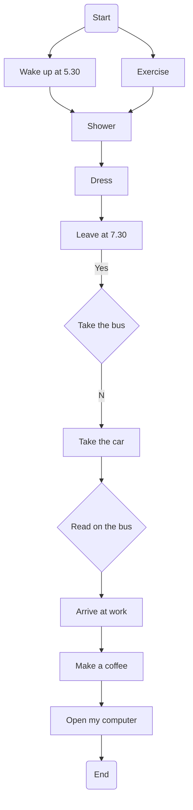

```mermaid
graph TD;
A-->B;
A-->C;
B-->D;
C-->D;
```

```mermaid
graph TB;
A(Start)--> B[Wake up at 5.30];
A --> C[Exercise];
B --> D[Lay out your clothes];
C --> D[Shower];
D --> E[Dress];
E --> F[Leave at 7.30];
F --Yes--> G{Take the bus};
G --No--> H[Take the car];
H -->I{Read on the bus}
I --> J[Arrive at work];
J --> K[Make a coffee];
K --> L[Open my computer];
L --> M(End)
```
