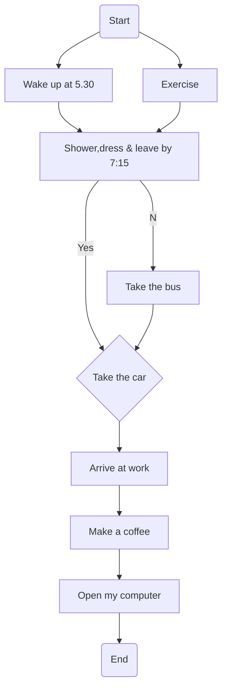

```mermaid
graph TD;
A-->B;
A-->C;
B-->D;
C-->D;
```

```mermaid
graph TB;
A(Start)--> B[Wake up at 5.30];
A --> C[Exercise];
B --> D[Lay out your clothes];
C --> D[Shower,dress & leave by 7:15];
D --Yes--> E{Take the car};
D --No--> F[Take the bus];
F --> E;
E --> G[Arrive at work];
G --> H[Make a coffee];
H --> I[Open my computer];
I --> J(End)
```
