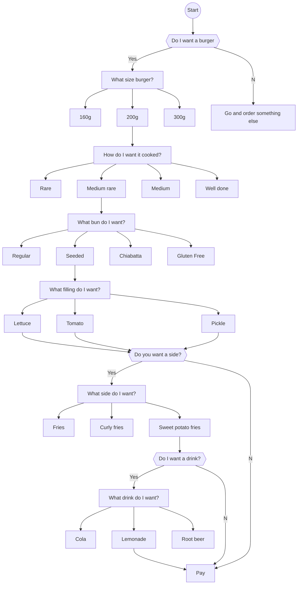

# Creating an API
## General Putnum Motel Diner API
This API is for customers of General Putnum Motel Diner to order online.
There is a GET.md for bills. There is a POST.md file for orders to the kitchen. I thank the Good Docs Project for their template. Also to Alex Fielder for their API document.  

