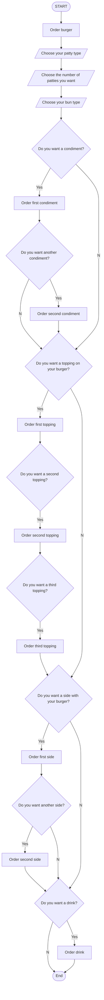

# Hamburger API Doc
This is the reference for the Hamburger API, which is part of the new Hamburger app of General Putnam Motel Diner (GPMD). With the Hamburger app, GPMD customers can place take-out orders in a touchless manner. 

This preliminary version of the app lets customers order only take-out hamburger meals. If the app is successful, GPMD plans to expand the app to include other meals from the GPMD menu and put the app on a tablet so that patrons can order from their seats in the diner.
The Hamburger API is used to interface between the Hamburger app and the server-side ordering system in GPMD's kitchen, which prints out orders for the cooks. 

The API follows REST principles, uses JSON to encode requests and responses, and relies on standard HTTP codes to signal operation outcomes.

The Hamburger API currently contains the following methods:
* [GET](get.md) - retrieves data from the server. In this case, the GET for the POC will be to GET the bill.
* [POST](post.md) - sends data to the server. In this case, the POST will send the customer’s order to the server in the kitchen. The printer in the kitchen will print out the order for the cook to use.

## Workflow
The app uses the following workflow:

## Credits
The idea for this project and all code snippets came from Alex Fiedler's [General Putnam Motel Diner API Guide](https://www.linkedin.com/feed/update/urn:li:activity:6626465471241732096/).

The endpoint references of this API are based on the “The Good Docs” project template for [API Reference](https://github.com/thegooddocsproject/templates/blob/master/api-reference/api-reference.md). 
