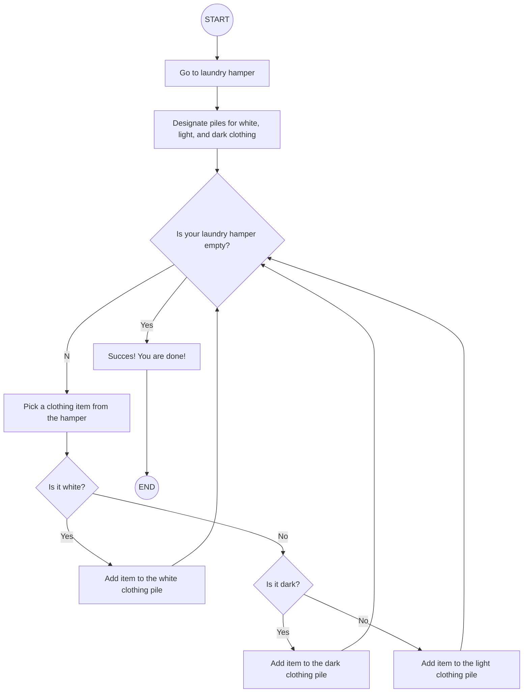

# How to Sort Your Laundry by Color

```mermaid
   flowchart TD;
   
   A((START)) --> B[Go to laundry hamper];
   B-->C[Designate piles for white, light, and dark clothing];
   C--> D{Is your laundry hamper empty?};
   D--Yes--> E[Succes! You are done!];
   D--No-->F[Pick a clothing item from the hamper];
   F-->G{Is it white?};
   G -- Yes --> H[Add item to the white clothing pile];
   H-->D;
   G -- No --> I{Is it dark?};
   I-- Yes --> J[Add item to the dark clothing pile];
   J-->D;
   I-- No --> K[Add item to the light clothing pile];
   K-->D;
   E ---> L((END))
```  
