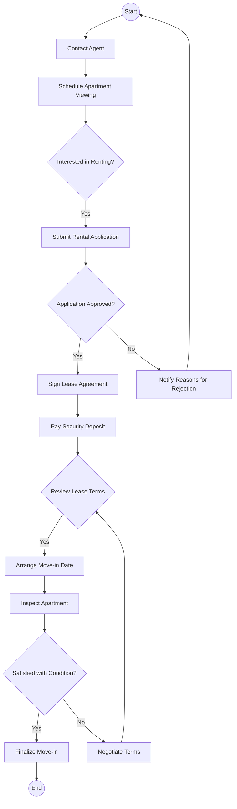

# Mermaid Example
## Flowchart Simple (Top Down)

```mermaid 
flowchart TD
    A((Start)) --> B[Contact Agent];
    B --> C[Schedule Apartment Viewing];
    C --> D{Interested in Renting?};
    D -- Yes --> E[Submit Rental Application];
    E --> F{Application Approved?};
    F -- Yes --> G[Sign Lease Agreement];
    G --> H[Pay Security Deposit];
    H --> I{Review Lease Terms};
    I -- Yes --> J[Arrange Move-in Date];
    J --> K[Inspect Apartment];
    K --> L{Satisfied with Condition?};
    L -- Yes --> M[Finalize Move-in];
    M --> N((End));
    L -- No --> O[Negotiate Terms];
    O --> I;
    F -- No --> P[Notify Reasons for Rejection];
    P --> A;
```
