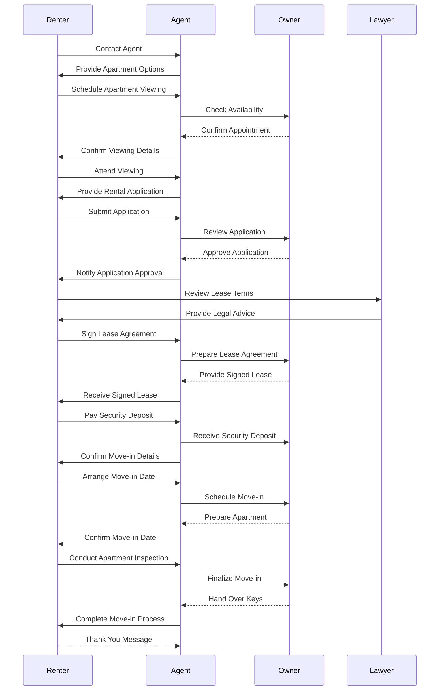

# Mermaid Assignment
## Sequence Simple

```mermaid 
sequenceDiagram
    participant Renter
    participant Agent
    participant Owner
    participant Lawyer

    Renter->>Agent: Contact Agent
    Agent->>Renter: Provide Apartment Options
    Renter->>Agent: Schedule Apartment Viewing
    Agent->>Owner: Check Availability
    Owner-->>Agent: Confirm Appointment
    Agent->>Renter: Confirm Viewing Details
    Renter->>Agent: Attend Viewing
    Agent->>Renter: Provide Rental Application
    Renter->>Agent: Submit Application
    Agent->>Owner: Review Application
    Owner-->>Agent: Approve Application
    Agent->>Renter: Notify Application Approval
    Renter->>Lawyer: Review Lease Terms
    Lawyer->>Renter: Provide Legal Advice
    Renter->>Agent: Sign Lease Agreement
    Agent->>Owner: Prepare Lease Agreement
    Owner-->>Agent: Provide Signed Lease
    Agent->>Renter: Receive Signed Lease
    Renter->>Agent: Pay Security Deposit
    Agent->>Owner: Receive Security Deposit
    Agent->>Renter: Confirm Move-in Details
    Renter->>Agent: Arrange Move-in Date
    Agent->>Owner: Schedule Move-in
    Owner-->>Agent: Prepare Apartment
    Agent->>Renter: Confirm Move-in Date
    Renter->>Agent: Conduct Apartment Inspection
    Agent->>Owner: Finalize Move-in
    Owner-->>Agent: Hand Over Keys
    Agent->>Renter: Complete Move-in Process
    Renter-->>Agent: Thank You Message


```
