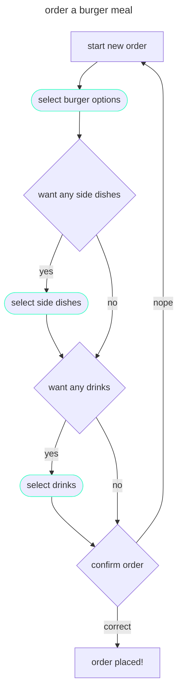

# Burger meal API

This is the Api documentation for placing orders for a burger meal and getting the bill back. use [GET on `/bill`](./get.md) endpont for bills and [post on `/order/burgerMeal`](/post.md) for ordering a burger meal.

## flow diagram

## credits

- Credits to [Alex Fiedler](linkedin.com/in/alexfiedler) for [this exercise](https://docs.google.com/document/d/11uNd8m5EorsLjGV84CjiJehiM8PxT2pdNbDFOnP3cDI/edit#).
- Credits to the [Good Docs Project](https://thegooddocsproject.dev/) for the [reference template](https://github.com/thegooddocsproject/templates/edit/master/api-reference/api-reference.md).
