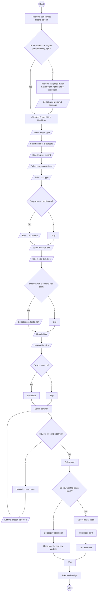

```mermaid
flowchart TD;

A((Start))-->B[Touch the self-service kiosk's screen];
B-->C{Is the screen set to your preferred language?};
C--No-->D[Touch the language button at the bottom right hand of the screen];
D-->E[/Select your preferred language/];
E-->F[Click the Burger Value Meal icon];
C--Yes-->F[Click the Burger Value Meal icon];
F-->G[/Select burger type/];
G-->H[/Select number of burgers/];
H-->I[/Select burger weight/];
I-->J[/Select burger cook level/];
J-->K[/Select bun type/];
K-->L{Do you want condiments?};
L--No-->M[Skip];
L--Yes-->N[/Select condiments/];
M-->O[/Select first side dish/];
N-->O[/Select first side dish/];
O-->P[/Select side dish size/];
P-->Q{Do you want a second side dish?};
Q--No-->R[Skip];
Q--Yes-->S[/Select second side dish/];
R-->T[/Select drink/];
S-->T[/Select drink/];
T-->U[/Select drink size/];
U-->V{Do you want ice?};
V--No-->W[Skip];
V--Yes-->X[Select ice];
W-->Y[Select continue];
X-->Y[Select continue];
Y-->Z{Review order: Is it correct?};
Z--No-->AA[Select incorrect item];
AA-->BB[/Edit the chosen selection/];
BB-->Y[Select continue];
Z--Yes-->CC[Select, pay];
CC-->DD{Do you want to pay at kiosk?};
DD--No-->EE[Select pay at counter];
EE-->FF[Go to counter and pay cashier];
DD--Yes-->GG[Select pay at kiosk];
GG-->HH[Run credit card];
HH-->II[Go to counter];
II-->JJ[Wait];
FF-->JJ[Wait];
JJ-->KK[Take food and go];
KK-->LL((End));

```
