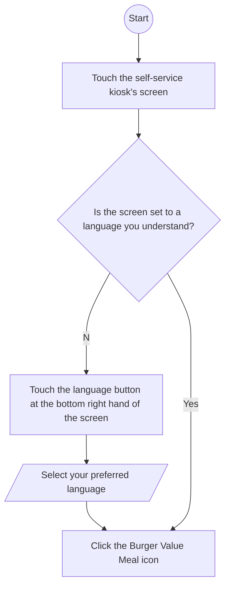

```mermaid
flowchart TD;

A((Start))-->B[Touch the self-service kiosk's screen];
B-->C{Is the screen set to a language you understand?};
C--No-->D[Touch the language button at the bottom right hand of the screen];
D-->E[/Select your preferred language/];
E-->F[Click the Burger Value Meal icon];
C--Yes-->F[Click the Burger Value Meal icon];


```
