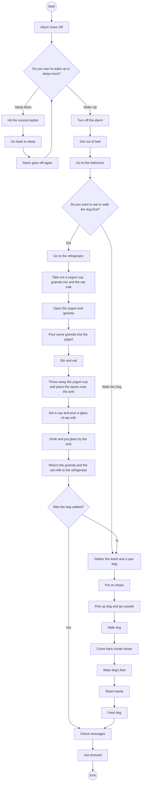

```mermaid
 flowchart TD
 A((Start))-->B[Alarm Goes Off];
 B-->C{Do you want to wake up or sleep more?};
 C--Sleep More-->D[Hit the snooze button];
 D-->E[Go back to sleep];
 E-->F[Alarm goes off again];
 F-->C{Do you wan to wake up or sleep more?}; 
 C--Wake Up-->G[Turn off the alarm];
 G-->H[Get out of bed];
 H-->I[Go to the bathroom];

 I-->J{Do you want to eat or walk the dog first?};
 J--Walk the Dog-->K[Gather the leash and a poo bag];
 K-->L[Put on shoes];
 L-->M[Pick up dog and go outside];
 M-->N[Walk dog];
 N-->O[Come back inside house];
 O-->P[Wipe dog's feet];
 P-->Q[Wash hands];
 Q-->R[Feed dog];

J--Eat-->S[Go to the refrigerator];
S-->T[Take out a yogurt cup, granola mix and the oat milk];
T-->U[Open the yogurt and granola]
U-->V[Pour some granola into the yogurt];
V-->W[Stir and eat];
W-->X[Throw away the yogurt cup and place the spoon near the sink];
X-->Y[Get a cup and pour a glass of oat milk];
Y-->Z[Drink and put glass by the sink];
Z-->AA[Return the granola and the oat milk to the refrigerator];

AA-->EE{Was the dog walked?};
EE--Yes-->BB;
EE--No-->K;


R-->BB[Check messages];
BB-->CC[Get dressed];
CC-->DD((End));
```

 
