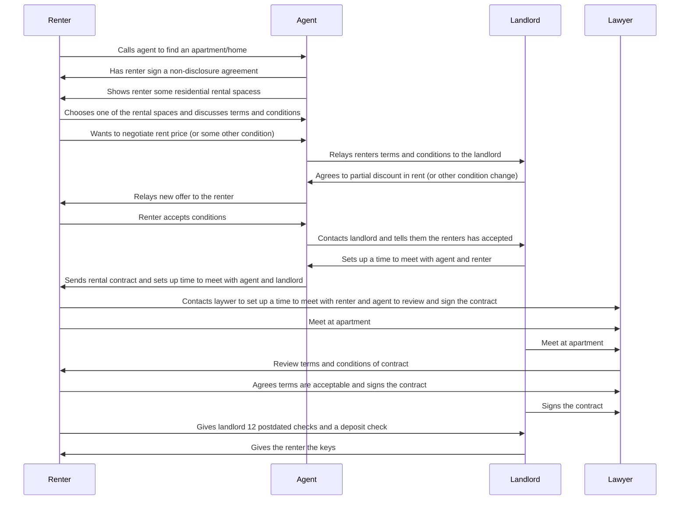

```mermaid
   sequenceDiagram
   Renter->>Agent: Calls agent to find an apartment/home;
   Agent->>Renter: Has renter sign a non-disclosure agreement;
   Agent->>Renter: Shows renter some residential rental spacess;
   Renter->>Agent: Chooses one of the rental spaces and discusses terms and conditions;
   Renter->>Agent: Wants to negotiate rent price (or some other condition); 
   Agent->>Landlord: Relays renters terms and conditions to the landlord;
   Landlord->>Agent: Agrees to partial discount in rent (or other condition change);
   Agent->>Renter: Relays new offer to the renter; 
   Renter->>Agent: Renter accepts conditions;
   Agent->>Landlord: Contacts landlord and tells them the renters has accepted;
   Landlord->>Agent: Sets up a time to meet with agent and renter;
   Agent->>Renter: Sends rental contract and sets up time to meet with agent and landlord;
   Renter->>Lawyer: Contacts laywer to set up a time to meet with renter and agent to review and sign the contract;
    Renter->>Lawyer: Meet at apartment;
   Landlord->>Lawyer: Meet at apartment;
   Lawyer->>Renter: Review terms and conditions of contract;
   Renter->>Lawyer: Agrees terms are acceptable and signs the contract; 
   Landlord->>Lawyer: Signs the contract;
   Renter->>Landlord: Gives landlord 12 postdated checks and a deposit check;
   Landlord->>Renter: Gives the renter the keys; 
``` 
   
   
   
   
   
