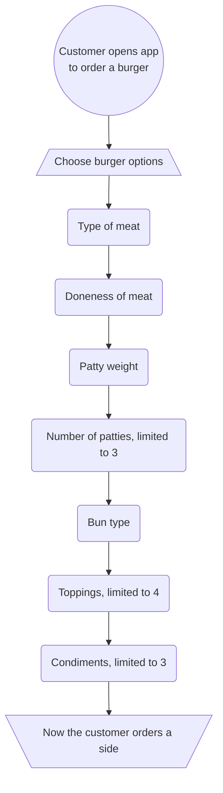
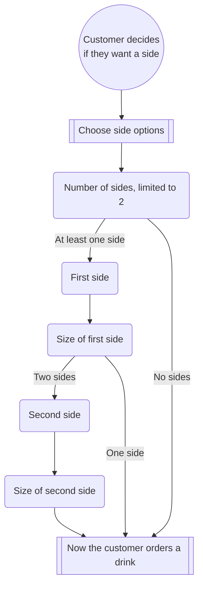
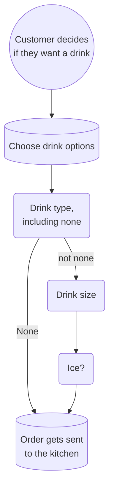

# Hamburger API Proof of Concept Documentation

## Overview

The General Putnam Motel Diner wants to create an app for its customers to order food easily and efficiently. This app needs to take orders from customers, send them to the kitchen, and calculate the bills for the customers. This POC focuses on ordering a burger at dinner time, but the plan for the app is to handle all kinds of meals throughout the day. This documentation explains how the customer's order is processed ([post.md](post.md)) and how the server gets the bill ([get.md](get.md)).

## Base URL

This is the base URL for all API calls:

```
https://api.gpmd.com
```

## Version

The current version of the API is 1.0.

## Endpoints

The API supports these two endpoints:

| Method | URL                | Description                              |
|--------|--------------------|------------------------------------------|
| POST   | /dinner/burgerMeal | Creates an order for the kitchen to make.<br>See [post.md](post.md) for more info. |
| GET    | /tableNo           | Retrieves the bill for the server.<br>See [get.md](get.md) for more info.        |

## Order customization

The customer can customize their burger, sides, and drink, as shown below ([burger flowchart](#ordering-a-burger), [sides flowchart](#ordering-sides), and [drink flowchart](#ordering-a-drink).

## Getting the Bill

When the customer requests the bill through the app, the order information and bill are sent to their server. The server can then bring the bill to the customer for them to pay. 

###  Ordering a burger


### Ordering sides


### Ordering a drink


#### Acknowledgements
This API documentation project is based on an exercise created by <a href="https://www.linkedin.com/feed/update/urn:li:activity:6626465471241732096/">Alex Feidler</a>. This API documentation is adapted from a template provided by <a href="https://thegooddocsproject.dev/">The Good Docs Project</a>.
