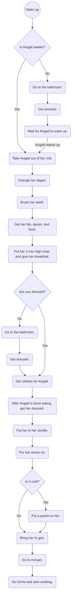

# Morning Routine

```mermaid

flowchart TD;
A((Wake up))-->B{Is Avigail awake?};
B-- Yes -->C(Take Avigail out of her crib.);
B-- No -->D(Go to the bathroom.);
D-->E(Get dressed.);
E-->F(Wait for Avigail to wake up.);
F-- Avigail wakes up -->C;
C-->G(Change her diaper.);
G-->H(Brush her teeth.);
H-->I(Get her bib, spoon, and food.);
I-->J(Put her in her high-chair and give her breakfast.);
J-->K{Are you dressed?};
K-- No -->L(Go to the bathroom.);
L-->M(Get dressed.);
M-->N;
K-- Yes -->N(Get clothes for Avigail.);
N-->O(After Avigail is done eating, get her dressed.);
O-->P(Put her in her stroller.);
P-->Q(Pur her shoes on.);
Q-->R{Is it cold?};
R-- Yes -->S(Put a jacket on her.);
R-- No -->T(Bring her to gan.);
S-->T;
T-->U(Go to minyan.);
U-->V(Go home and start working.);

```
