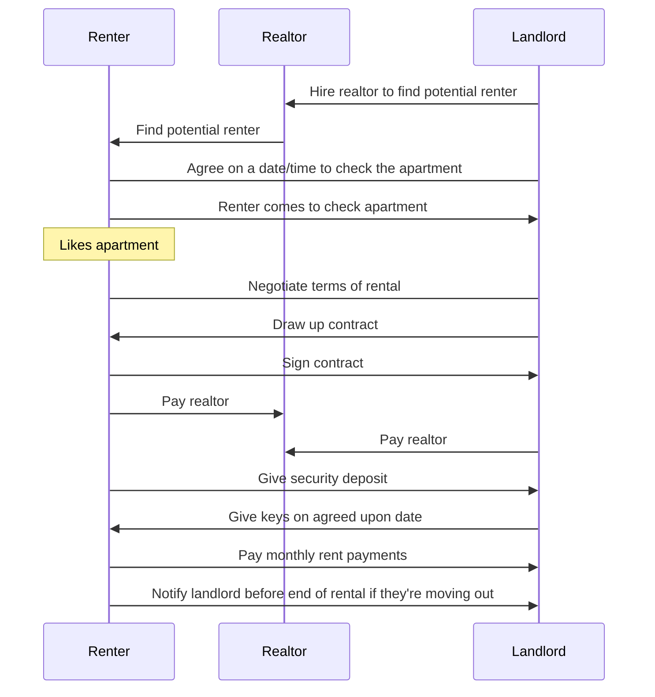

# Renting an apartment

```mermaid

sequenceDiagram
participant E as Renter
participant O as Realtor
participant L as Landlord
L->>O: Hire realtor to find potential renter
O->>E: Find potential renter
E->L: Agree on a date/time to check the apartment
E->>L: Renter comes to check apartment
Note over E: Likes apartment
E->L: Negotiate terms of rental
L->>E: Draw up contract
E->>L: Sign contract
E->>O: Pay realtor
L->>O: Pay realtor
E->>L: Give security deposit
L->>E: Give keys on agreed upon date
E->>L: Pay monthly rent payments
E->>L: Notify landlord before end of rental if they're moving out

```
