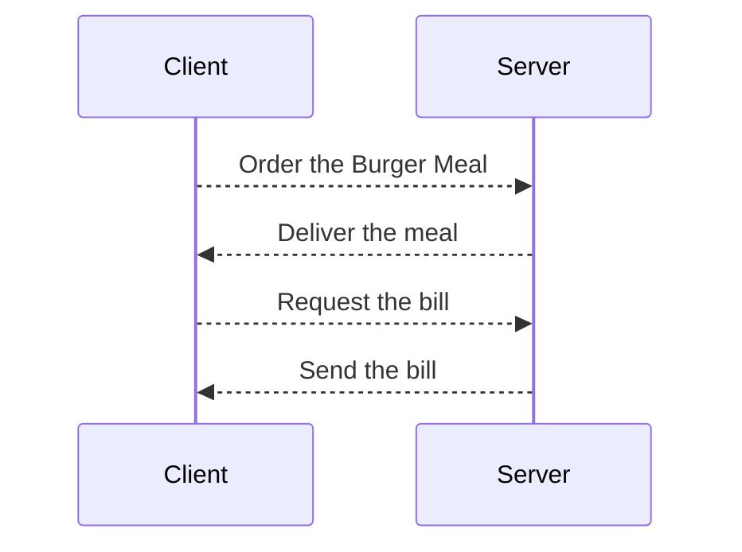

# Hamburger API Docs Proof of Concept (POC)  

## Introduction

This proof of concept (POC) documentation presents a simple demonstration of the touchless ordering system for General Putnam Motel Diner's patrons. The goal of this POC is to showcase the basic functionality of the app, allowing customers to place takeout orders conveniently. The API serves as the interface between the app and the server, enabling the transmission of orders from the app to the kitchen using the POST request, and retrieving the bill from the kitchen in response to a GET request.  For the purpose of this POC, this API documentation will be focusing on **Burger Meal** orders. If the POC will be accepted and a contract will be signed, this API will be extended to include all the items in the menu.  
Following are some diagrams to illustrate this API intended usage.

### General Workflow:
Following is a simplified sequence diagram to illustrate this API intended usage in the context of this POC:

### Ordering Process:

You can order a Burger Meal by sending a POST request to the server. As previously stated, this POC is for the Burger Meal only, in which a burger is mandatory.  
Following is a simplified diagram of the **Burger Meal** ordering:

  

Refer to [POST /meal/burgerMeal](post.md) API reference for detailed documentation.

### Billing Process:

You can request the bill by sending a GET request to the server, accompanied with the Table Number. If successfull, server will responde with the detailed bill.  
Following is a simplified diagram of the the bill request:  

  

Refer to [GET /meal/burgerMeal](get.md) API reference for detailed documentation.

### Credits

Special thanks to Alex Fiedler for providing the code snippets and the project idea.
