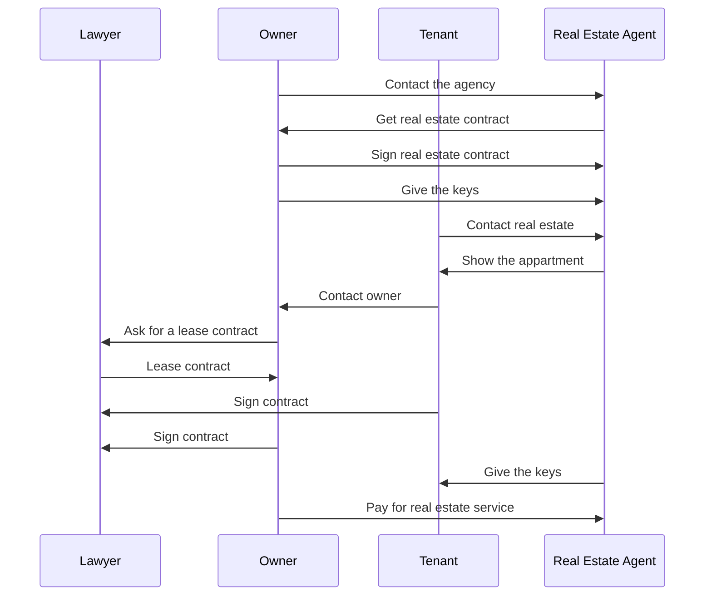

```mermaid
sequenceDiagram
participant Lawyer
participant Owner
participant Tenant
participant Real Estate Agent
Owner->>Real Estate Agent: Contact the agency
Real Estate Agent->>Owner: Get real estate contract
Owner->>Real Estate Agent: Sign real estate contract
Owner->>Real Estate Agent: Give the keys
Tenant->>Real Estate Agent: Contact real estate
Real Estate Agent->>Tenant: Show the appartment
Tenant->>Owner: Contact owner
Owner->>Lawyer: Ask for a lease contract
Lawyer->>Owner: Lease contract
Tenant->>Lawyer: Sign contract
Owner->>Lawyer: Sign contract
Real Estate Agent->>Tenant: Give the keys
Owner->>Real Estate Agent: Pay for real estate service
```
