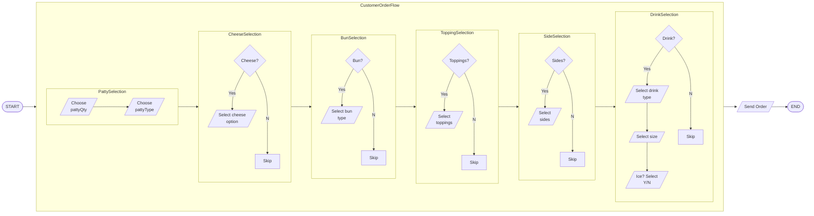

## ACME APP Co. Project Brief

#### Summary
ACME APP Co. is interested in working with General Putnam Motel Diner (GPMD) to build an app for its customers to place take out orders. Eventually, GPMD would like to use the app inside the diner, tableside, for customers to place their own orders via tablet. ACME APP Co. developers will build the meal order app on top of an existing REST API using GPMD's famous hamburger meal deal as a proof of concept (see [diagram](#customer-order-flow-diagram) below).

#### AppCorp Meal Order API
The AppCorp Meal Order API is an open source REST API available under GNU General Public License v3.0. The following endpoint documentation is available:
- [POST](https://github.com/TechWriterMelissa/student-showcase/blob/main/student-work/2023/Melissa-Ligertwood/api-final-project/get.md) - Place burger order
- [GET](student-work/2023/Melissa-Ligertwood/api-final-project/get.md) - Retrieve the bill

#### Customer Order Flow Diagram

*This work was completed as part of a Docs as Code course project at [Our Best Words](https://ourbestwords.com/training-courses/skills-courses/). We gratefully acknowledge use of [The Good Docs Project](https://gitlab.com/tgdp/templates/-/tree/main/api-reference?ref_type=heads) API template and reference materials, as well as supplemental API documentation provided by [Alex Fiedler](https://www.linkedin.com/feed/update/urn:li:activity:6626465471241732096/).* 
