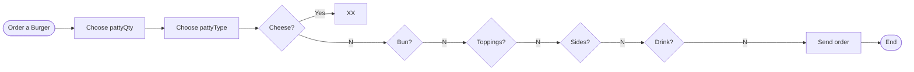

## How to order a burgerMeal

```JSON
  
```

```mermaid
flowchart LR

A([Order a Burger]) -->B[Choose pattyQty]
B -->C[Choose pattyType]
C -->D{Cheese?}
D --No-->E{Bun?}
D --Yes-->X[XX]
E --No-->F{Toppings?}
F --No-->G{Sides?}
G --No-->H{Drink?}
H --No------>I[Send order]
I -->K([End]) 


```

