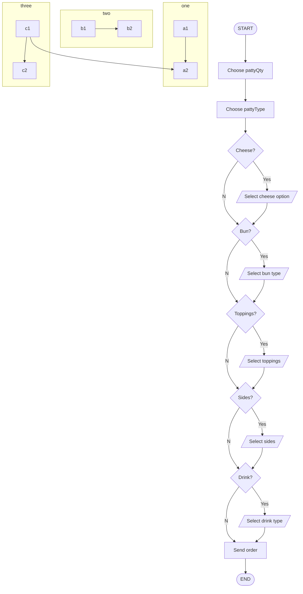

## How to order a burgerMeal

```mermaid
flowchart TD

    c1-->a2
    subgraph one
    a1-->a2
    end
    subgraph two
    b1-->b2
    end
    subgraph three
    c1-->c2
    end

A([START]) -->B[Choose pattyQty] -->C[Choose pattyType] -->D{Cheese?}
D --No-->E{Bun?}
E --No-->F{Toppings?}
F --No-->G{Sides?}
G --No-->H{Drink?}
H --No-->I([Send order])

D --Yes-->J[/Select cheese option/] 
J -->E
E --Yes-->K[/Select bun type/]
K -->F
F --Yes-->L[/Select toppings/]
L -->G
G --Yes-->M[/Select sides/]
M -->H
H --Yes-->N[/Select drink type/]
N -->I[Send order]

I -->Z([END])
```
