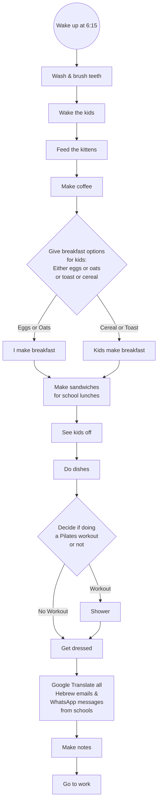

# Morning Routine

```mermaid
   flowchart TD
   A((Wake up at 6:15))-->B[Wash & brush teeth];
   B-->C[Wake the kids];
   C-->D[Feed the kittens];
   D-->E[Make coffee];
   E-->F{Give breakfast options <br> for kids: <br> Either eggs or oats <br> or toast or cereal};
   F--Eggs or Oats-->G[I make breakfast];
   F--Cereal or Toast-->H[Kids make breakfast];
   G-->I[Make sandwiches <br> for school lunches];
   H-->I[Make sandwiches <br> for school lunches];
   I-->J[See kids off];
   J-->K[Do dishes];
   K-->L{Decide if doing <br> a Pilates workout <br> or not};
   L--Workout-->M[Shower];
   L--No Workout-->N[Get dressed];
   M-->N[Get dressed];
   N-->O[Google Translate all <br> Hebrew emails & <br> WhatsApp messages <br> from schools];
   O-->P[Make notes];
   P-->Q[Go to work];
```
