# General Putnam Motel Diner API Documentation for the Burger Meal

## Introduction
The General Putnam Motel Diner API allows patrons of the diner to order their meals in a touchless manner via an app. For the purposes of the required POC, this API documentation is limited to ordering the Burger Meal at lunch time as a take-out order. In the future, the final product will include a full menu for different meal times.  

### A Basic Workflow for Placing an Order on the App  
(For the purposes of this POC, the workflow is limited to only selecting take-out for the Table ID, lunch for the mealType, and a Burger Meal for the MealCat.)

```mermaid  
   flowchart TD  
   A((Open the app))-->B[Sign in];
   B-->C[mealType select: lunch];
   C-->D[mealCat select: burgerMeal];
   D-->E[Select burger];
   E-->F[Select patty type];
   F-->G[Select patty amount];
   G-->H[Select level to which <br> patty should be cooked];
   H-->I[Select bun type];
   I-->J{Condiments?};
   J--Yes-->K[Select condiments. <br> Limited to 3];
   J--No-->L{Toppings?};
   K-->L{Toppings?};
   L--Yes-->M[Select toppings. <br> Limited to 4];
   L--No-->N{Side orders?};
   M-->N{Side orders?};
   N--Yes-->O[Select side orders. <br> No limit];
   O-->Q[Select size];  
   N--No-->P{Drink?};
   Q-->P{Drinks?};
   P--Yes-->R[Select drink. <br> Limited to 1];
   P--No-->S{Confirm order?};
   R-->T[Select size];
   T-->U[Select with/without ice];
   U-->S{Confirm order?};
   S--Yes-->V[Place order];
   S--No-->W[Make changes to order];
   W-->S{Confirm order?};  
   W-->V[Place order];
   





    
```


## Overview
The API is used to interface between the app and the server in the diner kitchen. Two main functions are presented:  
* **THE POST CALL:**
  * The app sends a command to the server: An order is submitted.
  * The server sends a response to the app acknowledging receipt of the request: The order is accepted and is printed in the kitchen for the meal to be prepared.  
* **THE GET CALL:**
  * The app requests information from the server: The bill is requested.
  * The server sends a response to the app: A bill is generated and a printout is given to the patron.
    
 ### Base URL
```
https://api.generalputnammoteldiner.com
```
### Authentication

Standard methods of authentication apply.

### HTTP status codes

The General Putnam Motel Diner APIs use the following standard HTTP response codes:

| Status code | Type                   | Description                         |
|-------------|------------------------|-------------------------------------|  
| 100         | Informational response | Request received, proceeding.       |  
| 200         | Successful response    | No further action needed from user. |

### Error Codes

The General Putnam Motel Diner APIs use the following error codes:

| Error code | Type                  | Description                           |
|------------|-----------------------|---------------------------------------|
| 400        | Client error          | Erroneous error.                      |  
| 404        | Client error          | Page not found.                       |  
| 500        | Internal server error | Server is down.                       |              

### Documentation
For further details, refer to: 

[POST Call Documentation](/post.md)  
[GET Call Documentation](student-work/2023/Natanya-DaCosta/api-final-project/get.md)  

### References/Credits

* [An Adaptation of the API Guide](https://docs.google.com/document/d/11uNd8m5EorsLjGV84CjiJehiM8PxT2pdNbDFOnP3cDI/edit?usp=sharing) by Alex Fiedler.
* The Google Docs Project [API Reference Template Guide](https://gitlab.com/tgdp/templates/-/blob/main/api-reference/guide-api-reference.md) and [API Reference Template](https://gitlab.com/tgdp/templates/-/blob/main/api-reference/template-api-reference.md).  


