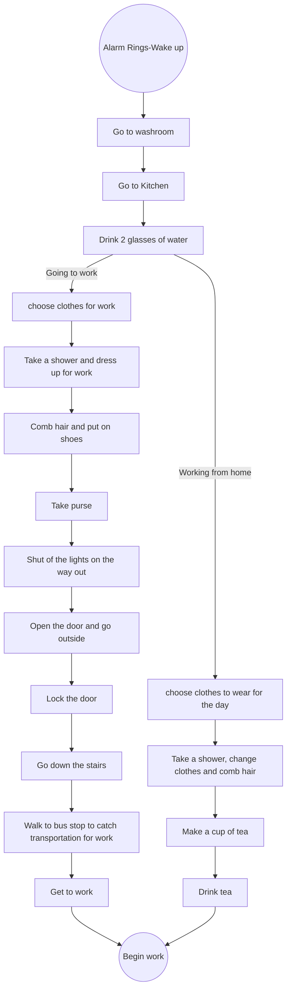

# Morning Routine  

```mermaid
   flowchart TD

A((Alarm Rings-Wake up))-->B[Go to washroom]
B-->C[Go to Kitchen]
C-->D[Drink 2 glasses of water]
D--Going to work-->E[choose clothes for work]
D--Working from home-->F[choose clothes to wear for the day]
E-->G[Take a shower and dress up for work]
G-->H[Comb hair and put on shoes]
H-->I[Take purse]
I-->J[Shut of the lights on the way out]
J-->K[Open the door and go outside]
K-->L[Lock the door]
L-->M[Go down the stairs]
M-->N[Walk to bus stop to catch transportation for work]
N-->O[Get to work]
O-->P((Begin work))
F-->Q[Take a shower, change clothes and comb hair]
Q-->R[Make a cup of tea]
R-->S[Drink tea]
S-->P((Begin work))
```
