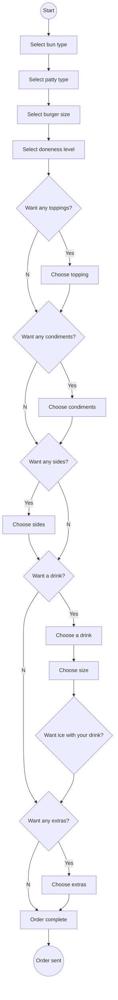

## General Putnam Motel Diner - Orders  

# Introduction

This proof of concept (POC) documentation demonstrates the touchless ordering system for General Putnam Motel Diner's patrons. The primary objective of this POC is to exhibit the app's core features, allowing customers to conveniently place takeout orders. The API acts as the intermediary between the app and the server, facilitating order transmission from the app to the kitchen through a POST request, and retrieving the bill from the kitchen in response to a GET request. This API documentation will focus on Burger Meal orders for the POC. If the POC is accepted and a contract is signed, the API will be expanded to include all menu items. Included below are diagrams illustrating the intended usage of this API.

# Logical Workflow  

# Credits
This exercise was borrowed from Alex Fiedler and adapted for our use. The workflow was created using Mermaid — a JavaScript-based diagramming and charting tool.
