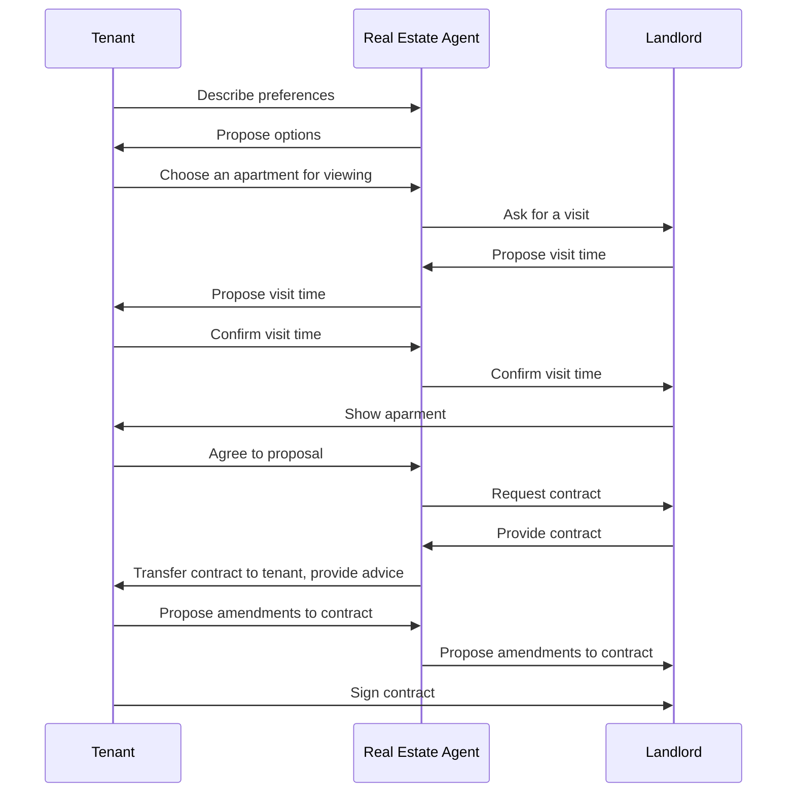

# Sequence Diagram

```mermaid
sequenceDiagram
    Tenant->>Real Estate Agent: Describe preferences;
    Real Estate Agent->>Tenant: Propose options;
    Tenant->>Real Estate Agent: Choose an apartment for viewing;
    Real Estate Agent->>Landlord: Ask for a visit;
    Landlord->>Real Estate Agent: Propose visit time;
    Real Estate Agent->>Tenant: Propose visit time;
    Tenant->>Real Estate Agent: Confirm visit time;
    Real Estate Agent->>Landlord: Confirm visit time;
    Landlord->>Tenant: Show aparment;
    Tenant->>Real Estate Agent: Agree to proposal;
    Real Estate Agent->>Landlord: Request contract;
    Landlord->>Real Estate Agent: Provide contract;
    Real Estate Agent->>Tenant: Transfer contract to tenant, provide advice;
    Tenant->>Real Estate Agent: Propose amendments to contract;
    Real Estate Agent->>Landlord: Propose amendments to contract;
    Tenant->>Landlord: Sign contract;
```
