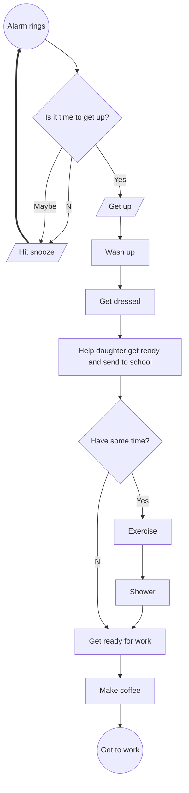

# Mermaid Morning Routine

```mermaid
   flowchart TD
   A((Alarm rings))-->B{Is it time to get up?};
   B--No-->C[/Hit snooze/];
   B--Maybe-->C[/Hit snooze/];
   B--Yes-->D[/Get up/];
   C==>A;
   D-->E[Wash up];
   E-->F[Get dressed];
   F-->G[Help daughter get ready and send to school];
   G-->H{Have some time?};
   H--Yes-->N[Exercise];
   N-->O[Shower];
   O-->P[Get ready for work];
   H--No-->P;
   P-->Q[Make coffee];
   Q-->R((Get to work))
```
