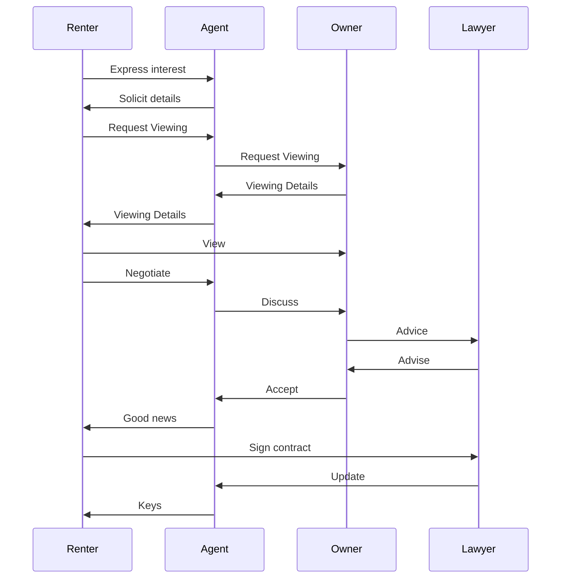

# Renting an Apartment

```mermaid
sequenceDiagram
  participant Renter
  participant Agent
  participant Owner
  participant Lawyer
  Renter->>Agent: Express interest
  Agent->>Renter: Solicit details
  Renter->>Agent: Request Viewing
  Agent->>Owner: Request Viewing
  Owner->>Agent: Viewing Details
  Agent->>Renter: Viewing Details
  Renter->>Owner: View
  Renter->>Agent: Negotiate
  Agent->>Owner: Discuss
  Owner->>Lawyer: Advice
  Lawyer->>Owner: Advise
  Owner->>Agent: Accept
  Agent->>Renter: Good news
  Renter->>Lawyer: Sign contract
  Lawyer->>Agent: Update
  Agent->>Renter: Keys
```
