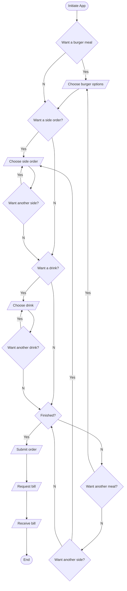

# GPMD API Reference

### Overview

This project is an exercise in providing API documentation for the fictitious General Putnam Motel Diner who have commissioned a limited API as a proof of concept (POC) for a customer meal ordering application. The scope of this POC is to provide two capabilities in the application:
1. To order a burger meal
2. To get a bill for the meal

The application developer needs the documentation in order to effectively use the API. The documentation is provided here in two files reflecting the two methods available in the API. These are <a href="post.md">POST.md</a> which documents the POST method to order a meal, and <a href="GET.md">GET.md</a> which documents the GET method to get the bill.

### Process Flow
The following flowchart describes the process of ordering a meal, with its constituent parts and getting the bill for the ordered meal.

### Endpoints

Use the following endpoints to interact with the GPMD entities.

| Method | Endpoint name               | Description             |
|--------|-----------------------------|-------------------------|
| POST   | /lunch                      | Creates a burger meal order. See <a href="post.md">POST.md</a>  |
| GET    | /tableNo                    | Retrieves a bill. See <a href="get.md">GET.md</a>|

### HTTP status codes

The GPMD APIs use the following standard HTTP response codes:

| Status code                    | Message              | Description                                         |
|--------------------------------|----------------------|-----------------------------------------------------|
| `100 - OK`                       | Continue             | No errors reported but but awaiting further data.   |  
| `200 - OK`                       | Success              | Request was received without errors.                      |
| `400 - Bad Request`            | Request refused        | Request unsuccessful. Check for invalid options.  |
| `401 - Unauthorized`           | Authorization failed | Authorization attempt failed. Check supplied values.|
| `500 - Internal Server Error`  | Server-side failure  | Contact server administrator.                       |

### Acknowledgements

This API document is based on an exercise developed by <a href="https://www.linkedin.com/feed/update/urn:li:activity:6626465471241732096/">Alex Feidler</a>. The API documentation is loosely based on the templates provided by <a href="https://thegooddocsproject.dev/">The Good Docs Project</a>.

