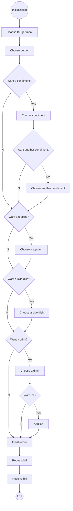

# General Putnam Motel Diner- API Reference
## Overview
In this project, we were tasked with creating API documentation for the fictitious General Putnam Motel Diner. General Putnam has commissioned the ACME app company to provide them with a limited version of the app as a POC (proof of concept). The POC demonstrates that the application has the following capabilites:
* Order a meal
* Get the bill

The developers have the API, but they need documentation so they can effectively use it. The documentation provided here demonstrates how to use the API to:
* <a href=post.md>Order a burger meal using the POST method</a>
* <a href=get.md>Retrieve the bill using the GET method</a>
## Workflow
The following flowchart demonstrates the process of ordering a burger meal and getting the bill.

## HTTP Status Codes
The General Putnam Motel Diner API follows the standard HTTP status codes for success or failure of an API call.
<table>
	<tr>
		<th>Status Code</th>
		<th>Message</th>
    <th>Description</th>
	</tr>
  <tr>
    <td><code>100 - Continue</code></td>
    <td>Continue</td>
    <td>The system is waiting for further information to be added.</td>
  </tr>
	<tr>
		<td><code>200 - OK</code></td>
    <td>Success</td>
		<td>Request was successfully submitted.</td>
  </tr>
	<tr>
		<td><code>400 - Bad Request</code></td>
    <td>Invalid request</td>
		<td>The system cannot process the request. Review the request and correct any errors.</td>
	</tr>
  <tr>
		<td><code>401 - Unauthorized</code></td>
    <td>Authorization Failure</td>
		<td>Authorization attempt failed. Try again. </td>
	</tr>
 <tr>
   <td><code>500 - Internal Server Error</code></td>
   <td>Server Error</td>
   <td> Contact server support</td>
 </tr>
</table>

## Acknowledgements
The idea for this project and the code snippets were provided by <a href="https://docs.google.com/document/d/11uNd8m5EorsLjGV84CjiJehiM8PxT2pdNbDFOnP3cDI/edit#heading=h.myhyr8hjvpl1">Alex Fiedler</a>. The documentation was written following the template provided by <a href="https://github.com/thegooddocsproject/templates/blob/master/api-reference/about-api-reference.md">"The Good Docs Project"</a>.
