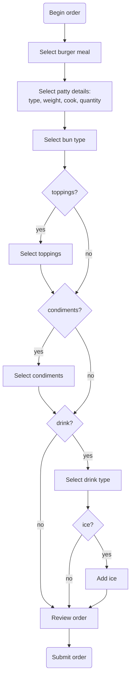

# General Putnam Motel Diner: Orders API

The Orders API allows you to place orders that with the kitchen staff and retrieve a bill based on the orders currently open at a table.

## Base URL

`https://api.gpmdiner.com`

## Endpoints
The API includes the following endpoints:

Name | Description
---- | -----------
[GET /bill](GET-bill.md) | Retrieves a table's bill.
[POST /order](POST-order-meal.md) | Creates an order and associates it with a table.

## General Response Codes

The API returns the following general response codes. The endpoint descriptions list case-specifc responses.

Code | Description
---- | -----------
400  | Bad Request: The request to the server was improperly formatted.
500  | Internal Server Error: An unexpected server error occured.

## API  Workflow

## References
I based this project on one designed by [Alex Fiedler](https://www.linkedin.com/feed/update/urn:li:activity:6626465471241732096/).

The API references in this project use 
[the template](https://github.com/thegooddocsproject/templates/blob/master/api-reference/api-reference.md) from The Good Docs project. 
