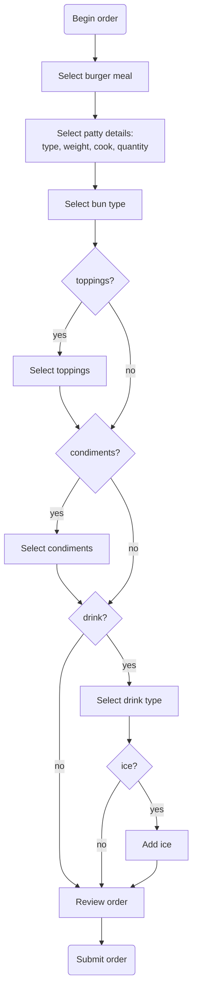

# ACME Putnam Diner App (POC)

The Putman Diner app allows customers at the diner to place orders from touchless screens. The app receives order requests and generates bills for tables. Requests use HTTP and follow RESTful architecture. Eventually, Putnam wants to build a mobile app so that customers can order via table-side tablets.

The POC version of the app needs to define two endpoints, one for [placing orders](POST-order-meal.md), and another for [generating a bill](GET-bill.md). This version only allows ordering burger meals on the lunch menu. The object structure to use for menu items when placing orders is in the [menu item list](menu-items.md).

## Workflow for Frontend

The UI design for the app should follow this flow:

## References
I based this project on one designed by [Alex Fiedler](https://www.linkedin.com/feed/update/urn:li:activity:6626465471241732096/).

The API references in this project use 
[the template](https://github.com/thegooddocsproject/templates/blob/master/api-reference/api-reference.md) from The Good Docs project. 
