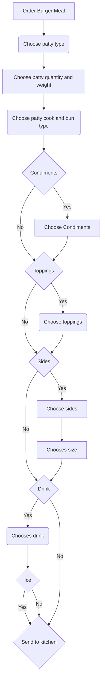

**Introduction**

The owners of General Putnam Motel Diner are creating an app for patrons to use to order take-out. In the future, they want to add the app to tablets, so patrons can order from their seats in the restaurant. I am creating a hamburger API, so that the developers can create a POC. At this time, it is only for lunch orders, but in the future, it will be expanded to other meals as well, such as dinner, breakfast, and events. 

These are examples of response codes

| Codes  | Responses                           |
|--------|-------------------------------------|
| 200 OK | The order has been placed correctly |
| 404    | Not Found                           |
| 429    | Too many requests                   |
| 500    | Internal service error              |

Acknowledgments: 

This exercise was borrowed and adapted by Alex Fiedler.

This exercise was borrowed and adapted by Good Docs Project Templates.
## Additional Topics
[Get request](https://github.com/Laura-Novich-OBW/student-showcase/blob/main/student-work/chana-willinger/Api-Final%20Project/GET.md)

[Post request](https://github.com/Laura-Novich-OBW/student-showcase/blob/main/student-work/chana-willinger/Api-Final%20Project/POST.md)
