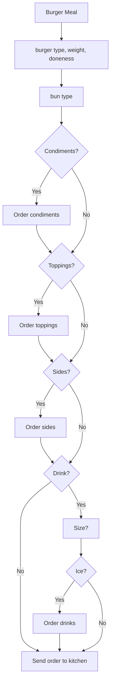

## ACME APP COMPANY API 

### Introduction
This API has been created for General Putnam Motel Diner in order for their customers to order takeout from the diner.
This POC will only depict the lunch meal and the order of a burger meal.
Future plans include adding breakfast, dinner, and meals other than a burger meal, along with their accompaniments.
This API is already set up to be used for in-house orders. Below you will see a workflow chart of the API.

### Additional Topics

[Get/tableNo](https://github.com/Laura-Novich-OBW/student-showcase/blob/main/student-work/felice-berk/API_Final_Project/GET.md)

[Post/lunch]()

### Acknowledgements

This exercise was borrowed and adapted from [Alex Fiedler](https://il.linkedin.com/in/alexfiedler?trk=public_post_share-update_actor-text).

Templates for API Reference were borrowed from [The Good Docs](https://github.com/thegooddocsproject/templates/edit/master/api-reference/api-reference.md).

Markdown workflow diagram was borrowed and adapted from [Mermaid](https://github.blog/2022-02-14-include-diagrams-markdown-files-mermaid/).
