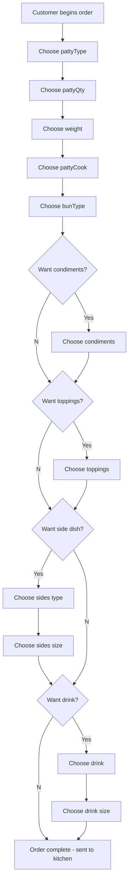

# General Putnam Motel Diner API

## Introduction

The General Putnam Motel Diner API has two main functions: 

- Let customers order and customize meals using an app.
- Let staff print out each table bill on request.

Completed orders are sent to the kitchen and printed on the in-house ticketing system.

## Content Type

Accept: application/json

Content-Type: application/json

## Resources

The General Putnam Motel Diner has the following resources: 

- [GET reference guide](https://github.com/JoeWainer/api-final-project/blob/main/get-reference-guide.md)
- [POST reference guide](https://github.com/JoeWainer/api-final-project/blob/main/post-reference-guide.md)

## Error Codes

The General Putnam Motel Diner follows HTTP status codes for success or failure. 

[See the list of error codes](https://github.com/JoeWainer/api-final-project/blob/main/error-codes.md). 

## API Workflow

## References 
* [The Good Docs Project](https://github.com/thegooddocsproject)
[Alex Fidler](https://www.linkedin.com/in/alexfiedler)
[Mermaid Project](https://github.com/mermaid-js/mermaid)
