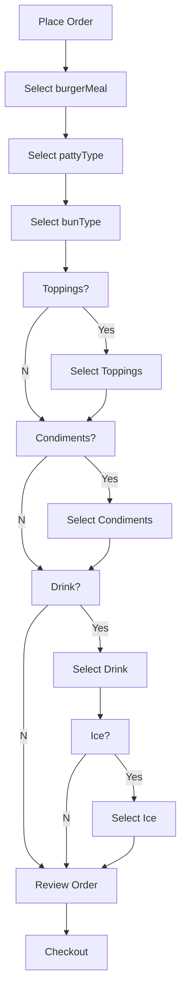

# General Putnam Diner API

## Introduction 

The owners of General Putnam Diner are creating an app for their customers to make touchless orders . This will enable customers to make takeout orders.

In the future, the owners would like to place the app on a tablet so customers can order from their seat. 

The application will interface with the server side ordering system in the kitchen which prints out orders for the cooks. The API is the interface between the app and the server. 

The diner hired ACME APP company to provide them with this app. The developers have been assigned to provide a proof of concept and finished app. Once approved, the General Putnam Diner will sign off and become a customer.

## Error Codes

The General Putnam Diner API follows codes based on the success or error of the order.

Code Type| Code Description 
--- | ---
200 OK | The order was placed successfully.
401 Order Incomplete | A section of the order was not filled out. Examples can include not filling out "pattyType" or not checking a selection for "drink."
405 Missing Information | The customer's contact information is missing. A cell phone number and email is required to complete an order. 
500 Internal Server Error | Generic error message.     

## Resources

These are the resources for the General Putnam API:

* [GET Reference Guide](https://github.com/Laura-Novich-OBW/student-showcase/blob/main/student-work/michael-felsenthal/api-final-project/GET%20table.md).

* [Post Reference Guide](https://github.com/Laura-Novich-OBW/student-showcase/blob/main/student-work/michael-felsenthal/api-final-project/POST.md).

## API Work Flow 

## References

* This project was based on one originally designed by [Alex Fiedler](https://www.linkedin.com/feed/update/urn:li:activity:6626465471241732096/).

* The diagram used in this API comes from [Mermaid](https://mermaid-js.github.io/mermaid/#/).

* The template from this project comes from [The Good Docs Project](https://github.com/thegooddocsproject/templates/blob/master/api-reference/api-reference.md). 

