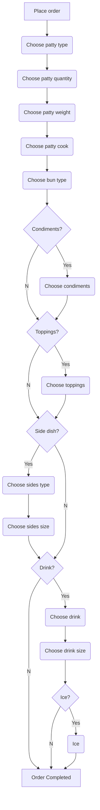

# General Putnam Motel Diner API - POC

## Overview

The General Putnam Motel Diner API POC illustrates two of many basic functions required for the Diner's operations:

* Takeout Order placement
* Bill Processing

The API POC will allow patrons to place a takeout order and get the bill. 

The API may be further developed to include features such digital orders for in-house patrons.

## Documentation

For details, refer to:

- [Takeout Order Documentation](https://github.com/solidoc365/student-showcase/blob/main/student-work/solidoc/api-final-project/Post-Order)
- [Bill Documentation](https://github.com/solidoc365/student-showcase/blob/main/student-work/solidoc/api-final-project/Get-Bill)

## General Response Codes

Code | Description
----- | ----------
100 | Request Received
200 | Request Successful
401 | Unauthorized
403 | Forbidden
404 | Page not Found
500 | Internal Server Error

## API Workflow

## References 
[The Good Docs Project](https://github.com/thegooddocsproject/templates)

[Mermaid Live Editor](link)

[Laura Novich, Instructor Extraordinaire at OBW](https://github.com/Laura-Novich-OBW)
